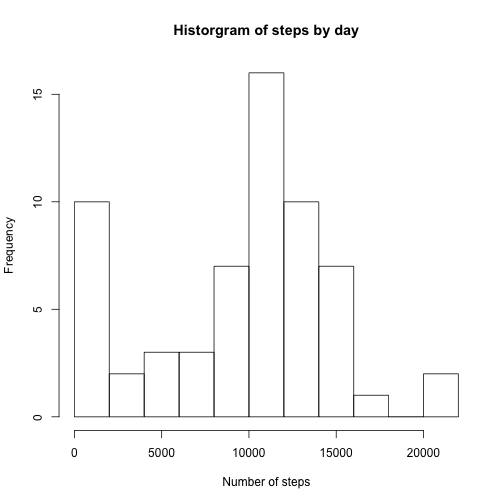
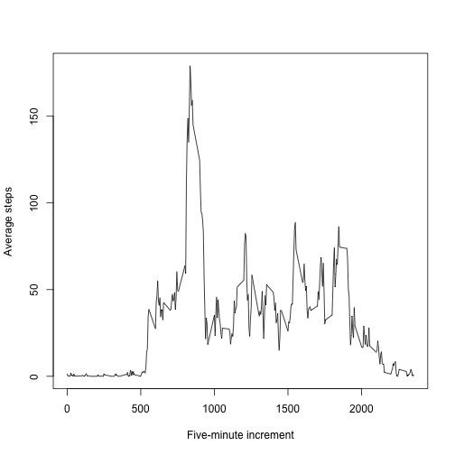
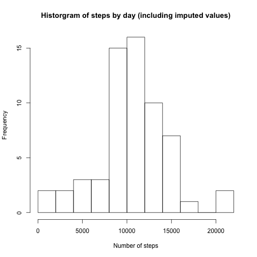
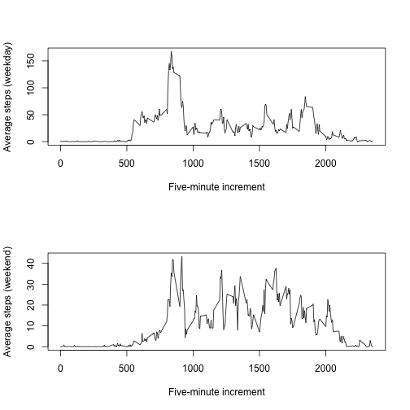

## Loading and preprocessing the data

I always start by calling any libraries I know I'll need.


```r
rm(list=ls())
library(ggplot2)
library(data.table)
```

```
## data.table 1.9.2  For help type: help("data.table")
```

```r
library(plyr)
```

Next, I set the working directory and loaded the data.  I checked out 
the head() of the data and do a summary() just to get a feel for it.

```r
# set working directory
setwd("/Users/maashu/Documents/datsci/Coursera - Reproducible Research")

#load raw file
myData <- read.csv("activity.csv")
head(myData)
```

```
##   steps       date interval
## 1    NA 2012-10-01        0
## 2    NA 2012-10-01        5
## 3    NA 2012-10-01       10
## 4    NA 2012-10-01       15
## 5    NA 2012-10-01       20
## 6    NA 2012-10-01       25
```

```r
summary(myData)
```

```
##      steps                date          interval     
##  Min.   :  0.00   2012-10-01:  288   Min.   :   0.0  
##  1st Qu.:  0.00   2012-10-02:  288   1st Qu.: 588.8  
##  Median :  0.00   2012-10-03:  288   Median :1177.5  
##  Mean   : 37.38   2012-10-04:  288   Mean   :1177.5  
##  3rd Qu.: 12.00   2012-10-05:  288   3rd Qu.:1766.2  
##  Max.   :806.00   2012-10-06:  288   Max.   :2355.0  
##  NA's   :2304     (Other)   :15840
```

Next, I inspected the data just to see what it looked like.
When I discovered the NA values in the steps column of the
dataframe, I decided to set those values to zero so the
mean() function wouldn't return an NA value, and checked
to see how many unique dates were in the file. This would
serve as the denominator for getting the mean steps per 
day.  I made the assumption that "mean" in this case was
over all days in the dataset, not just days that had
data.


```r
myCleanedData <- myData
myCleanedData[is.na(myCleanedData$steps), "steps"] <- 0
sum(myCleanedData$steps)
```

```
## [1] 570608
```

```r
numberOfDays <- length(unique(myData$date))
```

Next, I compared the number of steps in my cleaned dataset 
to the number of steps in the original set just as a sanity check:


```r
sum(myData$steps, na.rm=TRUE)
```

```
## [1] 570608
```

```r
sum(myCleanedData$steps)
```

```
## [1] 570608
```

```r
myMean <- sum(myCleanedData$steps) / numberOfDays
DT <- data.table(myCleanedData)
setkey(DT, date)

DT.median <- DT[,sum(steps),by=date]
hist(DT.median$V1, breaks=10, main="Historgram of steps by day", xlab="Number of steps")
```

 

```r
myMedian <- median(DT.median$V1)
myMedian <- as.character(myMedian)
```

## What is mean total number of steps taken per day?

The mean number of steps taken per day was 9354.2295082, and the median number
of steps taken per day was 10395.

## What is the average daily activity pattern?

As you can see from teh plot below, it looks like this person is sleeping for the first 100
five-minute increments or so (up to the 500 mark), and then slowly gets up and around, with
a spike in activity between about increment 810 and 905.  Activity then has a few peaks
and valleys for the rest of the day, and slows down considerably after about increment 2000.


```r
DT2 <- data.table(myCleanedData)
setkey(DT2, interval)
byInterval <- DT[,sum(steps),by=interval]

steps.ts <- byInterval$V1 / numberOfDays
steps.ts <- cbind(byInterval$interval, steps.ts)
plot(steps.ts, type="l", xlab="Five-minute increment", ylab="Average steps")
```

 

```r
colnames(steps.ts) <- c("increment", "steps")

byInterval <- data.frame(byInterval)
maxInterval <- byInterval[byInterval$V1 == max(byInterval$V1),"interval"]
maxSteps <- byInterval[byInterval$V1 == max(byInterval$V1),2]
avgMaxSteps <- maxSteps / numberOfDays
maxSteps <- as.character(maxSteps)
```
The five-minute interval that contains the most steps averaged across all days is
interval 835, where this person logged a total of 10927 over the
time period, an average of 179.1311475 per day.


## Imputing missing values

For this, we'll go back to the original dataset.  If you sum() over a vector of TRUE/FALSE
values, you'll get the total number of values that are TRUE:

```r
naRowcount <- sum(is.na(myData$steps))
```
The total number of rows with NA values is 2304

My strategy for setting NA values to something per the assignment is to assign the mean
by that time interval.  We've already got the total values by interval in the byInterval
data.frame.  The new dataset I created for this purpose is called myDataImputed.


```r
myDataImputed <- myData

colnames(byInterval) <- c("interval", "steps")
byInterval$avgSteps <- byInterval$steps / numberOfDays
#myDataImputed[is.na(myDataImputed$steps),]
myDataImputed$newSteps <- -1
for (i in 1:nrow(myDataImputed)) {
  if(is.na(myDataImputed[i,"steps"])) {
    #avgStepsByInterval <- byInterval[byInterval$interval == myData[i,"interval"],"avgSteps"]
    #myData$newSteps <- avgStepsByInterval
    myDataImputed[i,"newSteps"] <- byInterval[byInterval$interval == myDataImputed[i,"interval"],"avgSteps"]

   }
}
myDataImputed[is.na(myDataImputed$steps),"steps"] <- myDataImputed[is.na(myDataImputed$steps),"newSteps"]

myDataNew <- myDataImputed[,c("steps","date","interval")]
```
Now for the histogram of total steps per day, mean and median number of steps per day (I assumed
this was to be performed on the imputed dataset):


```r
DT.imputed <- data.table(myDataImputed)
setkey(DT.imputed, date)

DT.imputed.median <- DT.imputed[,sum(steps),by=date]
hist(DT.imputed.median$V1, breaks=10, main="Historgram of steps by day (including imputed values)", xlab="Number of steps")
```

 

```r
myMedian.imputed <- median(DT.imputed.median$V1)
myMedian.imputed <- as.character(myMedian)
myMean.imputed <- sum(myDataImputed$steps) / numberOfDays
myMean.imputed <- as.character(myMean.imputed)
```
For the imputed data, the median number of steps per day is 10395 and the
mean number of steps per day is 10581.013705993.

These values differ from the estimates from the first part of the assignment by a fair amount - the
impact of imputing missing data on the estimates of the total daily number of steps is that it
inflates the number of steps taken on average and by median.

## Are there differences in activity patterns between weekdays and weekends?

Yes.  As the following time series plots show, while the activity is fairly similar
for about the first 1000 time increments, from about 900 - 2000 there is a marked
increase in activity on the weekends.  The time periods of greatest activity appear
to be similar between weekdays and weekends, but on average, this person moves
much more on the weekends than on the weekdays.

```r
myDataImputed$dow <- weekdays(as.Date(myDataImputed$date))

myDataImputed$dow <- as.factor(revalue(myDataImputed$dow, c("Saturday"="weekend", "Sunday"="weekend", "Monday"="weekday", "Tuesday"="weekday", "Wednesday"="weekday"
,"Thursday"="weekday", "Friday"="weekday")))

par(mfrow=c(2,1))


DT3 <- data.table(myDataImputed)
setkey(DT3, interval)
byInterval3 <- DT3[,sum(steps),by=c("interval","dow")]

steps.ts3.weekday <- byInterval3[byInterval3$dow == "weekday",V1] / numberOfDays
steps.ts3.weekend <- byInterval3[byInterval3$dow == "weekend",V1] / numberOfDays
steps.ts3.weekday <- cbind(byInterval$interval, steps.ts3.weekday)
steps.ts3.weekend <- cbind(byInterval$interval, steps.ts3.weekend)
plot(steps.ts3.weekday, type="l", xlab="Five-minute increment", ylab="Average steps (weekday)")
plot(steps.ts3.weekend, type="l", xlab="Five-minute increment", ylab="Average steps (weekend)")
```

 

# knit2html("PA1_template.Rmd")
